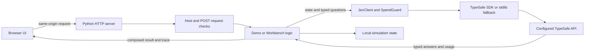

# Architecture

Jev Lab is a local web application. One Python process serves static pages, accepts JSON API
requests, holds simulation state, and calls TypeSafe through a shared client. The frontend uses
native JavaScript modules and browser APIs; no compilation is required.

## Request flow

[`server.py`](../server.py) defines page mappings, JSON routes, key onboarding, and the HTTP
handler. Served pages receive a per-process token. [`static/js/common.js`](../static/js/common.js)
adds that token to requests, builds shared UI elements, and renders model answers and traces.

[`jev/client.py`](../jev/client.py) is the application boundary for external API access. It
constructs requests, translates transport errors into `JevError`, records latency and usage,
estimates cost, and checks the local budget and rate window. It uses the official SDK when
available and a standard-library transport otherwise. Python 3.10+ with locked dependencies is
the primary setup; Python 3.9's dependency-free fallback is retained for compatibility.

## Judgments and policy

Demo modules build typed questions, consume answers, and combine them with deterministic rules.
Questions should ask about one dimension at a time. Model answers do not replace code-level
arithmetic, lookups, or authorization checks.

| Module | Responsibility |
| --- | --- |
| [`jev/hello.py`](../jev/hello.py) | Homepage playground: four questions against one message |
| [`jev/shield.py`](../jev/shield.py) | Email questions, sender facts, weights, and verdict rules |
| [`jev/dispatch.py`](../jev/dispatch.py) | Candidate extraction, typed action resolution, policy checks, and confidence thresholds |
| [`jev/autopilot.py`](../jev/autopilot.py) | Combined Shield/Dispatch requests, comparison worlds, approvals, and call benchmark |
| [`jev/find.py`](../jev/find.py) | Document line IDs, ranking, and answer-existence judgments |
| [`jev/play.py`](../jev/play.py) | Game sessions, hidden words, turn limits, and probability-based replies |
| [`jev/workbench.py`](../jev/workbench.py) | Request validation, saved tests, expectations, bulk calls, and code exports |
| [`jev/examples.py`](../jev/examples.py) | Workbench example question sets |
| [`jev/world.py`](../jev/world.py) | Fictional business state, deterministic action checks, and mutations |
| [`jev/scenarios.py`](../jev/scenarios.py) | Synthetic inbox messages, labels, and commands |
| [`jev/config.py`](../jev/config.py) | Project paths and environment/`.env` configuration |
| [`jev/envfile.py`](../jev/envfile.py) | Git safety checks and atomic key-file writes |
| [`jev/security.py`](../jev/security.py) | Loopback Host, Origin, Fetch Metadata, session-token, and content-type checks |

Shield reweighting and Dispatch replanning reuse existing model answers without another API call.
Autopilot merges both sets of questions into a single request with prefixed IDs, splits the
answers, and evaluates integrated and Dispatch-alone paths against separate worlds. The
Dispatch-alone comparison reuses those answers; it does not make an additional model call.
The explicit benchmark makes five calls: two sequential, two parallel, and one merged.

## State and persistence

- Dispatch has one in-memory `World`. Autopilot has independent integrated and comparison worlds.
  Resets and server restarts restore their seed state. Actions do not call real business systems.
- Games and Autopilot processing records also live in memory.
- Workbench items are written to `data/workbench/<id>.json`. They persist across restarts and are
  intentionally available for version control. They contain input data and expectations.
- `.env` stores optional local configuration and an API key; it must stay gitignored and untracked.
- Bundled sample documents and rows live in `data/samples/`. Screenshots live in `docs/screenshots/`.

The HTTP server uses threads. Shield batch and Workbench evaluation use bounded thread pools;
Workbench bulk concurrency is eight. A 401 or 402 stops either batch from starting further calls,
and a single Shield failure stays on that message instead of failing the whole batch. Dispatch
will only run a call that this process has already planned, and it re-checks block rules against
the current world first. The client synchronizes spend accounting (including in-flight budget
holds) and SDK creation, and worlds use locks for mutations. This is still a single-user demo,
with no database, durable job queue, or multi-process coordination.

## Test boundaries

The offline suite feeds API-shaped fake answers through real policy code, exercises the SDK
through an in-memory transport, and checks the HTTP handler over loopback. It verifies program
behavior without depending on live model judgments.

[`scripts/validate.py`](../scripts/validate.py) exercises the bundled scenarios using real API
calls. It reports observations and mismatches for human review; it is not an automated quality
gate. Its exit status indicates execution errors. Workbench saved expectations provide another
way to compare actual model results over time.

For setup and contribution checks, see [CONTRIBUTING.md](../CONTRIBUTING.md). For trust boundaries,
key handling, and the limitations of estimated spending guards, see [SECURITY.md](../SECURITY.md).
